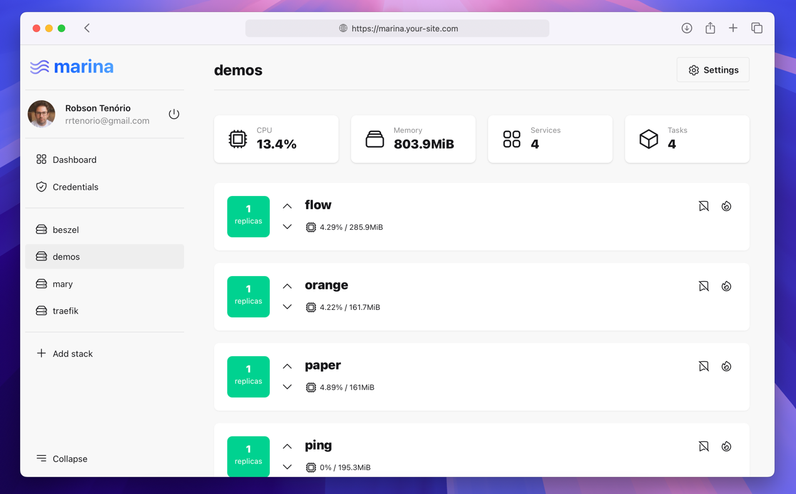
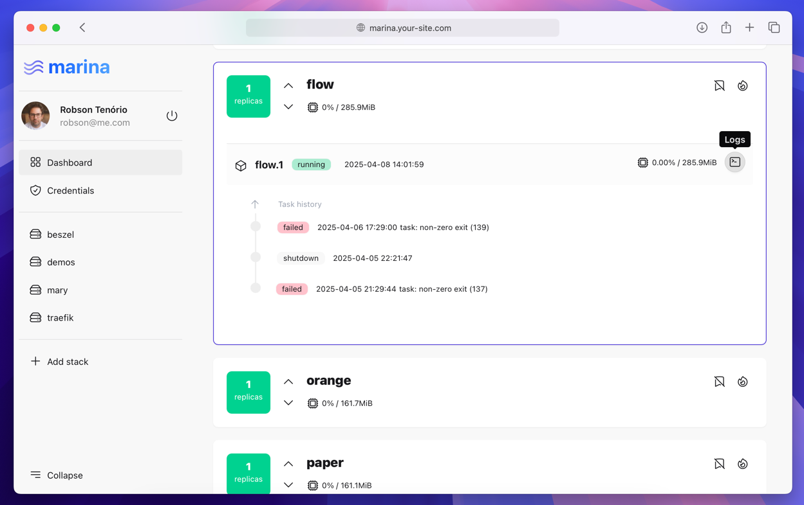
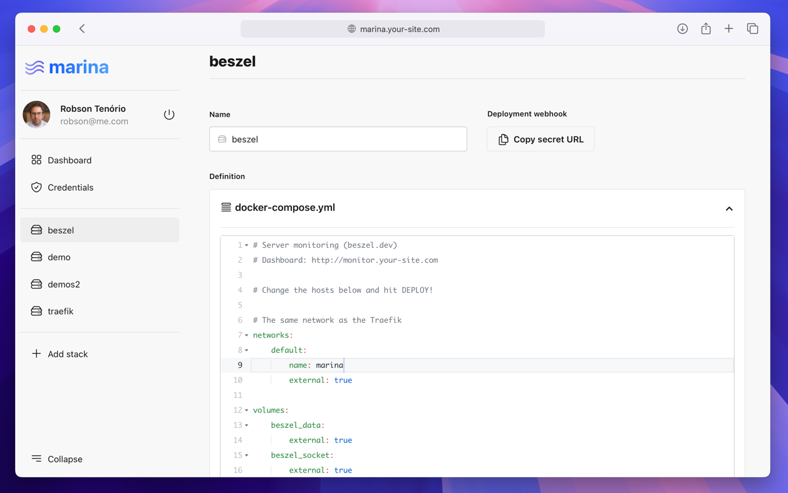
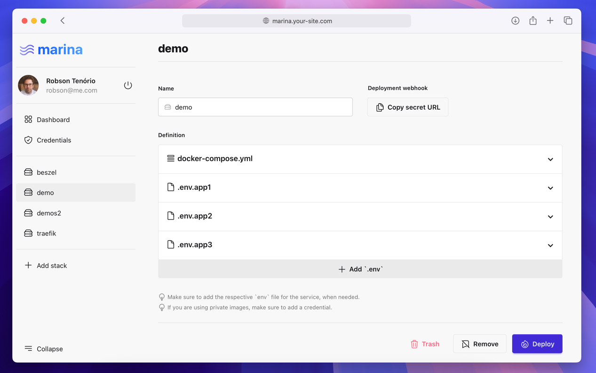

<p align="center"></p>

## Introduction

Marina is a lightweight web interface for managing Docker Swarm. It lets you deploy stacks using `docker-compose.yaml` files and view running containers.

# Screenshots

<table>
  <tr>
    <td></td>
    <td></td>
    <td></td>
    <td></td> 
  </tr>
</table>

## Install

Run this on a **fresh server**. Besides marina, it installs Docker and initializes Swarm mode.

```bash
sh -c "$(curl -fsSL https://github.com/robsontenorio/marina/raw/main/install.sh)"
```

**Done!** See http://SERVER-IP:8787

## Upgrading

```bash
docker service update --force --image ghcr.io/robsontenorio/marina:<TAG> marina
```

## Example

See a real world [usage example](.example/README.md).

## Contributing

Clone the repository.

```bash
git clone git@github.com:robsontenorio/marina.git
```

Create `.env` from `.env.example` and adjust few vars.

```bash
APP_ENV=local
APP_DEBUG=true
```

Start and access the container.

```bash
cd .docker/ && docker-compose up -d && docker compose exec marina zsh   
```

**Inside the running container** ... install, migrate and start the app.

```bash
# See `composer.json`

composer start
```

**Done!** See http://localhost:8787

## Follow me

[@robsontenorio](https://twitter.com/robsontenorio)
