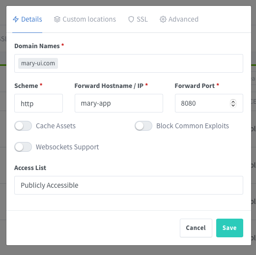

# Multiple projects on a single server

This document describes how to set up multiple projects on the same server using Docker.

## When to use it

- Projects does not have a lot of traffic.
- You want to save money.


## Pre-requisites

- A project on GitHub.
- A VPS with Docker installed.
- A domain name registered on Cloudflare.
- Be comfortable with Docker and GitHub Actions.


## Overview


**Guidelines**

- Set the **Nginx Proxy Manager** to forward the traffic to the correct container.
- Build the project images using **GitHub Actions** and push to **GitHub Registry**.
- Use **Watchtower** to deploy automatically new versions of images from your project.
- Each project has **it own** `docker-compose.yml`.


## The final result

The following folder structure on your **VPS** represents the sites you want to deploy.

```bash
YOUR_VPS
|   
|__ proxy.mary-ui.com/        # Nginx Proxy Manager + Watchtower
|   |
|   |__ docker-compose.yml
|
|__ mary-ui.com/              # Project 1
|   |
|   |__ .env   
|   |__ database.sqlite
|   |__ docker-compose.yml
|
|__ flow.mary-ui.com/         # Project 2
|   |
|   |__ .env   
|   |__ database.sqlite
|   |__ docker-compose.yml
|
|__ orange.mary-ui.com/       # Project 3
   |
   |__ .env   
   |__ database.sqlite
   |__ docker-compose.yml
```

## Repositories

Although you can use any name you want, we named the repositories to match the site we want to deploy.  
Notice that we will not pull directly these repositories into the **VPS**, it js just a name convention.


## GitHub Actions
Set up a GitHub Action on your repository to build the project Docker images and push them to the **Private GitHub Registry**.

```bash
robsontenorio/mary-ui.com         # Github repository
|   
|__ .docker/
|    |
|    |__ Dockerfile                   
|
|__ .github/
|    |
|    |__ workflows/
|       |
|       |__ docker-publish.yml    # <-- You are here!
|               
|__ app/
|__ bootstrap/
|__ database/
|__ ...
``` 

**Approach**
- If you push git a tag like `x.y.z`, build the `production` docker image tag.
- If you push git a tag like `stage-xxxx`, build the `stage` docker image tag.

**Why?**
- You need a fixed tag to use on the `docker-compose.yml` files.
- Otherwise, you will need to update the `docker-compose.yml` file every time you push a new image.

**Images**  

The GitHub Action will produce these images that will be used to set up the projects on your **VPS**.
- `ghcr.io/robsontenorio/mary-ui.com:production` 
- `ghcr.io/robsontenorio/mary-ui.com:stage`


<details>
<summary>Click to see</summary>

```yml
# robsontenorio/mary-ui.com/.github/workflows/docker-publish.yml

name: Create and publish a Docker image

on:
  push:
    tags:
      - '[0-9]+.[0-9]+.[0-9]+'        # any `x.y.z` tag builds the `production` image
      - 'stage-*'                     # the `stage-xxxx` pattern tag builds the`stage` image

env:
  REGISTRY: ghcr.io
  IMAGE_NAME: ${{ github.repository }}

jobs:
  build-and-push-image:
    runs-on: ubuntu-latest
    permissions:
      contents: read
      packages: write
    steps:
      - name: Checkout repository
        uses: actions/checkout@v4

      - name: "Log in to the Container registry"
        uses: docker/login-action@v3.1.0
        with:
          registry: ${{ env.REGISTRY }}
          username: ${{ github.actor }}
          password: ${{ secrets.GITHUB_TOKEN }}

      - name: "Check Github Tag"
        id: check-tag
        run: |
          if [[ ${{ github.event.ref }} =~ ^refs/tags/[0-9]+\.[0-9]+\.[0-9]+$ ]]; then
              echo "IS_PRODUCTION=true" >> $GITHUB_OUTPUT
          fi

          if [[ ${{ github.event.ref }} =~ ^refs/tags/stage-(.*)$ ]]; then
              echo "IS_STAGE=true" >> $GITHUB_OUTPUT
          fi

      - name: "Extract Docker metadata (tags, labels)"
        id: meta
        uses: docker/metadata-action@v5.5.1
        with:
          images: ${{ env.REGISTRY }}/${{ env.IMAGE_NAME }}
          flavor: |
            latest=false
          tags: |
            type=raw,value=production,enable=${{  steps.check-tag.outputs.IS_PRODUCTION == 'true' }}
            type=raw,value=stage,enable=${{  steps.check-tag.outputs.IS_STAGE == 'true' }}

      - name: "Build and push Docker images"
        uses: docker/build-push-action@v5.3.0
        with:
          context: .
          file: .docker/Dockerfile
          push: true
          tags: ${{ steps.meta.outputs.tags }}
          labels: ${{ steps.meta.outputs.labels }}
```
</details>

## Point your domains to VPS 

- The root registered domain is `mary-ui.com`
- You can also create subdomains
  - `flow.mary-ui.com` 
  - `orange.mary-ui.com`
  - ...
- All of them points to the same IP address of your **VPS**.

> [!TIP]
> Cloudflare provides the SSL certificate for all domains/subdomains for free. So, you do not need to do anything else on your VPS.


## Docker network

Create a docker network. All projects must join to this network.

```bash
docker network create mary
```


## The proxy project

Actually we set up two things here:
- **Nginx Proxy Manager** to forward all incoming traffic to the correct project.
- **Watchtower** to deploy automatically new versions of images from your project.


```bash
YOUR_VPS
|   
|__ proxy.mary-ui.com/          
    |
    |__ docker-compose.yml  # <!---- You are here!
```

```yml
networks:
    default:
        name: mary
        external: true

services:

    ####### NGINX PROXY ##########
  
    mary-proxy:
        #image: jc21/nginx-proxy-manager:latest (TODO)
        image: jc21/nginx-proxy-manager:github-pr-3478
        container_name: mary-proxy
        restart: unless-stopped
        ports:
            - 80:80
            - 81:81
            - 443:443
        volumes:
            - ./data:/data
            - ./letsencrypt:/etc/letsencrypt

    ######## WATCHTOWER ########
    
    mary-watchtower:
        image: containrrr/watchtower
        container_name: mary-watchower
        # Use the `container_name` (not service name) of the projects you want to watch
        command: mary-app flow-app orange-app  --log-level error --interval 5 --rolling-restart
        volumes:
            - /var/run/docker.sock:/var/run/docker.sock
            - /root/.docker/config.json:/config.json
```

**Run it**

After started, you can access the Nginx Proxy Manager at `http://YOUR-VPS-IP-ADDRESS:81`

```
docker-compose up -d
```

**Configure the first proxy host** 

On `Hosts > Proxy Hosts`:
- Add `proxy.mary-ui.com` domain as follows.
- This domain will proxy to the **Nginx Proxy Manager** panel itself.
- After saving, you can access the panel at `https://proxy.mary-ui.com`


> [!WARNING]
> Remember you have configured Cloudflare to point to the IP address of your **VPS**. 

> [!WARNING]
> There is no need to configure the SSL certificate. Cloudflare will do it for you.

> [!WARNING]
> Notice the scheme is always `http`, because we are inside the VPS and communicating with docker containers.

> [!WARNING]
> As we are working with Docker  **always use the service name and the port** described on `docker-compose.yml` files.

## Private GitHub Registry

Our images were pushed to the **Private GitHub Registry** using **GitHub Actions**.

Run the following script on your **VPS** to authenticate you on the Private GitHub Registry and be able to pull private images.
It will store the auth token  at `~/.docker/config.json`. 

[How to get a GitHub Classic Token?](https://docs.github.com/en/authentication/keeping-your-account-and-data-secure/managing-your-personal-access-tokens#creating-a-personal-access-token-classic)

```bash
# Replace the variables

export CR_PAT=<YOUR_GITHUB_CLASSIC_TOKEN> &&
echo $CR_PAT| docker login ghcr.io -u <YOUR_GITHUB_USERNAME> --password-stdin
```
> [!TIP]
> You need to do it once for all projects on this VPS.


## Add the `mary-ui.com` project
Create the following files on your **VPS**.

```bash
YOUR_VPS
|   
|__ proxy.mary-ui.com/          # This already exists, it rules all projects
|   |
|   |__ docker-compose.yml
|
|__ mary-ui.com/                # <-- New project 
    |
    |__ .env                
    |__ docker-compose.yml
    |__ database.sqlite
```
**.env**

```bash
APP_URL=http://mary-ui.com
APP_ENV=production
APP_DEBUG=false
APP_KEY=base64:....
```

**docker-compose.yml**
```yml
networks:
  default:
    name: mary
    external: true

services:
    mary-app:                                                   # <-- referenced by `Nginx Proxy Manager`
        container_name: mary-app                                # <-- referenced by `Watchtower`
        image: ghcr.io/robsontenorio/mary-ui.com:production     # <-- Use fixed `production` tag, it was pushed by GitHub Actions
        restart: always
        pull_policy: always
        env_file:
          - .env
        volumes:
  	      - ./database.sqlite:/var/www/app/database/database.sqlite
```

**SQLite**

Give correct permission to SQLite database, because we will mount it to the container.

```
chown 1000:1000 database.sqlite
```

**Configure the proxy host**



**Run it**  

```bash
# Inside the `mary-ui.com/` folder

docker compose up -d
```

After started, you can access the site at `http://mary-ui.com`


## Adding new projects

```bash
YOUR VPS
|   
|__ proxy.mary-ui.com/        # This already exists, it rules all projects
|   |
|   |__ docker-compose.yml
|
|__ flow.mary-ui.com/         # <-- New project
   |
   |__ .env   
   |__ database.sqlite
   |__ docker-compose.yml

```

This works exactly the same way as the `mary-ui.com` project.

1. Prepare your GitHub repository with actions to build and push the images.
1. Set up a domain on Cloudflare and point it to the IP address of your **VPS**.
1. Create the folder structure on your **VPS**.
1. Add a proxy host for `flow.mary-ui.com` on **Nginx Proxy Manager**.
1. Add the "container name" on **Watchtower** service at `proxy.mary-ui.com/docker-compose.yml`.

Reload the proxy container to apply the changes.

```bash
# Inside the `YOUR_VPS/proxy.mary-ui.com/` folder

docker compose up -d
```

Run the project.

```bash
# Inside the `YOUR_VPS/flow.mary-ui.com/` folder

docker compose up -d
```