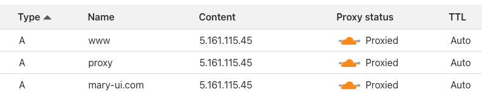
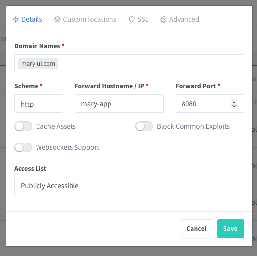

# A single project on a single server

This document describes how to set up a single project on a single server.

## When to use it

- Your project has a lot of traffic.
- You want to save money.

## Pre-requisites

- A project on GitHub.
- A VPS with Docker installed.
- A domain name registered on Cloudflare.
- Be comfortable with Docker and GitHub Actions.


## Overview


**Guidelines**

- Set the **Nginx Proxy Manager** to forward the incoming traffic to the correct container.
- Build the project images using **GitHub Actions** and push to **GitHub Registry**.
- Use **Watchtower** to deploy automatically new versions of images from your project.
- A single `docker-compose.yml`.


## The final result

The following folder structure on your **VPS** represents the site you want to deploy.

```bash
YOUR_VPS
|   
|__ mary-ui.com/              # Project 
   |
   |__ .env   
   |__ database.sqlite
   |__ docker-compose.yml
```


## GitHub Actions
Set up a GitHub Action on your repository to build the project Docker images and push them to the **Private GitHub Registry**.

```bash
robsontenorio/mary-ui.com         # Github repository
|   
|__ .docker/
|    |
|    |__ Dockerfile                   
|
|__ .github/
|    |
|    |__ workflows/
|       |
|       |__ docker-publish.yml    # <-- You are here!
|               
|__ app/
|__ bootstrap/
|__ database/
|__ ...
``` 

**Approach**
- If you push git a tag like `x.y.z`, build the `production` docker image tag.
- If you push git a tag like `stage-xxxx`, build the `stage` docker image tag.

**Why?**
- You need a fixed tag to use on the `docker-compose.yml` files.
- Otherwise, you will need to update the `docker-compose.yml` file every time you push a new image.

**Images**

The GitHub Action will produce these images that will be used to set up the projects on your **VPS**.
- `ghcr.io/robsontenorio/mary-ui.com:production`
- `ghcr.io/robsontenorio/mary-ui.com:stage`


<details>
<summary>Click to see</summary>

```yml
# robsontenorio/mary-ui.com/.github/workflows/docker-publish.yml

name: Create and publish a Docker image

on:
  push:
    tags:
      - '[0-9]+.[0-9]+.[0-9]+'        # any `x.y.z` tag builds the `production` image
      - 'stage-*'                     # the `stage-xxxx` pattern tag builds the`stage` image

env:
  REGISTRY: ghcr.io
  IMAGE_NAME: ${{ github.repository }}

jobs:
  build-and-push-image:
    runs-on: ubuntu-latest
    permissions:
      contents: read
      packages: write
    steps:
      - name: Checkout repository
        uses: actions/checkout@v4

      - name: "Log in to the Container registry"
        uses: docker/login-action@v3.1.0
        with:
          registry: ${{ env.REGISTRY }}
          username: ${{ github.actor }}
          password: ${{ secrets.GITHUB_TOKEN }}

      - name: "Check Github Tag"
        id: check-tag
        run: |
          if [[ ${{ github.event.ref }} =~ ^refs/tags/[0-9]+\.[0-9]+\.[0-9]+$ ]]; then
              echo "IS_PRODUCTION=true" >> $GITHUB_OUTPUT
          fi

          if [[ ${{ github.event.ref }} =~ ^refs/tags/stage-(.*)$ ]]; then
              echo "IS_STAGE=true" >> $GITHUB_OUTPUT
          fi

      - name: "Extract Docker metadata (tags, labels)"
        id: meta
        uses: docker/metadata-action@v5.5.1
        with:
          images: ${{ env.REGISTRY }}/${{ env.IMAGE_NAME }}
          flavor: |
            latest=false
          tags: |
            type=raw,value=production,enable=${{  steps.check-tag.outputs.IS_PRODUCTION == 'true' }}
            type=raw,value=stage,enable=${{  steps.check-tag.outputs.IS_STAGE == 'true' }}

      - name: "Build and push Docker images"
        uses: docker/build-push-action@v5.3.0
        with:
          context: .
          file: .docker/Dockerfile
          push: true
          tags: ${{ steps.meta.outputs.tags }}
          labels: ${{ steps.meta.outputs.labels }}
```
</details>


## Point your domain to VPS

- The root registered domain is `mary-ui.com`
- Create an extra `proxy` subdomain.
- Point all of them to the IP address of your **VPS**.

> [!TIP]
> Cloudflare provides the SSL certificate for all domains/subdomains for free. So, you do not need to do anything else on your VPS.





## Docker network

Create a docker network. All projects must join to this network.

```bash
docker network create mary
```

## The  setup

```bash
YOUR_VPS
|   
|__ mary-ui.com/     # <!---- You are here!    
    |
    |__ .env
    |__ database.sqlite
    |__ docker-compose.yml  
```
**.env**

```bash
APP_URL=http://mary-ui.com
APP_ENV=production
APP_DEBUG=false
APP_KEY=base64:....
```

**SQLite**

Give correct permission to SQLite database, because we will mount it to the container.

```
chown 1000:1000 database.sqlite
```

**docker-compose.yml**

- **Your project** docker image.
- **Nginx Proxy Manager** to forward all incoming traffic to the correct project.
- **Watchtower** to deploy automatically new versions of images from your project.

```yml
networks:
    default:
        name: mary
        external: true

services:
    ####### YOUR PROJECT ##########
  
    mary-app:                                                   # Referenced by `Nginx Proxy Manager`
        container_name: mary-app                                # Referenced by `Watchtower`
        image: ghcr.io/robsontenorio/mary-ui.com:production     # Use fixed `production` tag, it was pushed by GitHub Actions
        restart: always
        pull_policy: always
        env_file:
          - .env
        volumes:
          - ./database.sqlite:/var/www/app/database/database.sqlite

    ####### NGINX PROXY ##########
  
    mary-proxy:
        #image: jc21/nginx-proxy-manager:latest (TODO)
        image: jc21/nginx-proxy-manager:github-pr-3478
        container_name: mary-proxy
        restart: unless-stopped
        ports:
            - 80:80
            - 81:81
            - 443:443
        volumes:
            - ./data:/data
            - ./letsencrypt:/etc/letsencrypt

    ######## WATCHTOWER ########
    
    # Important: Use the `container_name` (not service name) of the projects you want to watch
    
    mary-watchtower:
        image: containrrr/watchtower
        container_name: mary-watchower        
        command: mary-app --log-level error --interval 5 --rolling-restart
        volumes:
            - /var/run/docker.sock:/var/run/docker.sock
            - /root/.docker/config.json:/config.json
```

**Run it**

After started, you can access the **Nginx Proxy Manager** at `http://YOUR-VPS-IP-ADDRESS:81`

```
docker-compose up -d
```

## Configure the proxy host

> [!WARNING]
> Remember you have configured Cloudflare to point to the IP address of your **VPS**.

> [!WARNING]
> There is no need to configure the SSL certificate. Cloudflare will do it for you.

> [!WARNING]
> Notice the scheme is always `http`, because we are inside the VPS and communicating with docker containers.

> [!WARNING]
> As we are working with Docker  **always use the service name and the port** described on `docker-compose.yml` files.


On `Hosts > Proxy Hosts`:
- Add `proxy.mary-ui.com` domain as follows.
- This domain will proxy to the **Nginx Proxy Manager** panel itself.
- After saving, you can access the panel at `https://proxy.mary-ui.com`


- Now, add a new proxy host for `mary-ui.com` domain.  
- Notice the port `8080` is exposed by `robsontenorio/laravel` docker image.
- After saving, you can access at `https://mary-ui.com`



## Additional containers

You can keep adding other projects and  on the same `docker-compose.yml` file and configure the **Nginx Proxy Manager** to redirect the traffic to the correct container.

**Pros**
- Easy to manage.

**Cons**
- Some changes in the `docker-compose.yml` can cause downtime in another running images.

