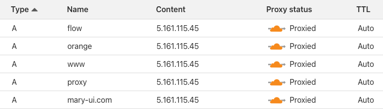
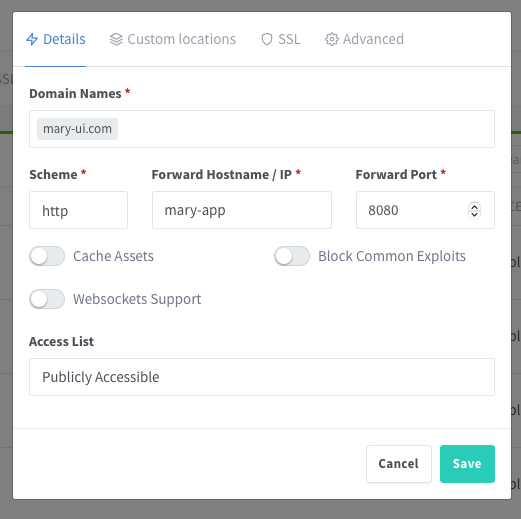
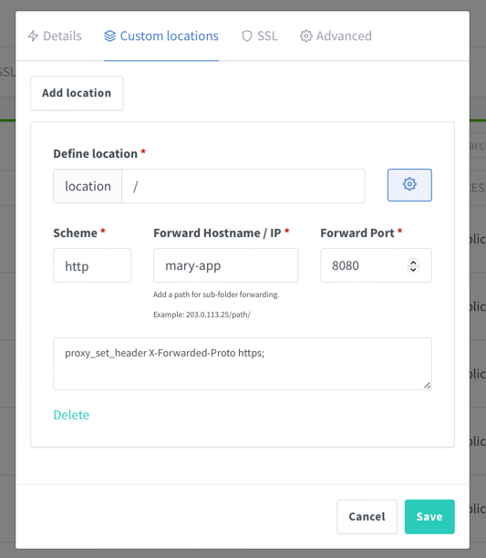

# Docker Swarm 

A simple approach to deploy **multiple** Laravel projects using Docker Swarm on **same server**.

[TODO IMAGE]

**GUIDELINES**

- **Nginx Proxy Manager** forwards all the incoming traffic to the correct container.
- **GitHub Actions** build the images and push to **GitHub Private Registry**.
- **xxxx** will monitor for new versions of images from your project.
- **Swarm** will handle zero downtime deployments and rollback.

## When to use it

- Projects does not have a lot of traffic.
- You want to put them all on same server to save money.


## Pre-requisites

- A project on GitHub.
- A brand-new VPS.
- A domain name registered on Cloudflare.
- Be comfortable with Docker
Be comfortable GitHub Actions.


## GitHub Actions
Set up a GitHub Action on **each repository** to build docker images and push them to the **Private GitHub Registry**.

```bash
# Github repository

robsontenorio/mary-ui.com         
|   
|__ .docker/
|    |
|    |__ Dockerfile                   
|
|__ .github/
|    |
|    |__ workflows/
|       |
|       |__ docker-publish.yml    # <-- You are here!
|               
|__ app/
|__ bootstrap/
|__ database/
|__ ...
``` 

--- 

<details>
<summary>Click to see the GitHub Action</summary>

```yml
# github.com/robsontenorio/mary-ui.com/.github/workflows/docker-publish.yml

name: Create and publish a Docker image

on:
  push:
    tags:
      - '[0-9]+.[0-9]+.[0-9]+'        # any `x.y.z` tag builds the `production` image
      - 'stage-*'                     # the `stage-xxxx` pattern tag builds the`stage` image

env:
  REGISTRY: ghcr.io
  IMAGE_NAME: ${{ github.repository }}

jobs:
  build-and-push-image:
    runs-on: ubuntu-latest
    permissions:
      contents: read
      packages: write
    steps:
      - name: Checkout repository
        uses: actions/checkout@v4

      - name: "Log in to the Container registry"
        uses: docker/login-action@v3.1.0
        with:
          registry: ${{ env.REGISTRY }}
          username: ${{ github.actor }}
          password: ${{ secrets.GITHUB_TOKEN }}

      - name: "Check Github Tag"
        id: check-tag
        run: |
          if [[ ${{ github.event.ref }} =~ ^refs/tags/[0-9]+\.[0-9]+\.[0-9]+$ ]]; then
              echo "IS_PRODUCTION=true" >> $GITHUB_OUTPUT
          fi

          if [[ ${{ github.event.ref }} =~ ^refs/tags/stage-(.*)$ ]]; then
              echo "IS_STAGE=true" >> $GITHUB_OUTPUT
          fi

      - name: "Extract Docker metadata (tags, labels)"
        id: meta
        uses: docker/metadata-action@v5.5.1
        with:
          images: ${{ env.REGISTRY }}/${{ env.IMAGE_NAME }}
          flavor: |
            latest=false
          tags: |
            type=raw,value=production,enable=${{  steps.check-tag.outputs.IS_PRODUCTION == 'true' }}
            type=raw,value=stage,enable=${{  steps.check-tag.outputs.IS_STAGE == 'true' }}

      - name: "Build and push Docker images"
        uses: docker/build-push-action@v5.3.0
        with:
          context: .
          file: .docker/Dockerfile
          push: true
          tags: ${{ steps.meta.outputs.tags }}
          labels: ${{ steps.meta.outputs.labels }}
```
</details>

--- 

**Images**

The above GitHub Action will produce these images:
- `ghcr.io/robsontenorio/mary-ui.com:production`
- `ghcr.io/robsontenorio/mary-ui.com:stage`

**Approach**
- A git tag like `x.y.z` always builds the `production` docker image tag.
- A git tag like `stage-xxxx` always builds the `stage` docker image tag.

**Why?**
- You need a fixed tag to use on the `docker-compose.yml` files.
- Otherwise, you will need to update the `docker-compose.yml` every time you push a new docker image tag.


## VPS Setup 

**DOCKER** 
```bash
# Install Docker
curl -fsSL https://get.docker.com -o get-docker.sh &&
sudo sh ./get-docker.sh &&

# Enable on startup
sudo systemctl enable docker.service &&
sudo systemctl enable containerd.service &&

# Init Swarm
docker swarm init
```

**GITHUB PRIVATE REGISTRY**  

This is required to pull images from GitHub Private Registry using a [GitHub Classic Token]((https://docs.github.com/en/authentication/keeping-your-account-and-data-secure/managing-your-personal-access-tokens#creating-a-personal-access-token-classic)). 

```bash
export CR_PAT=<REGISTRY_TOKEN> &&
echo $CR_PAT| docker login ghcr.io -u <USERNAME> --password-stdin 
```

## Project setup

**NETWORK**

All services will join to this network.

```bash
docker network create -d overlay mary
```

**VOLUMES**

Create all needed volumes for each service.

```bash
# Apps
docker volume create mary-db &&
docker volume create paper-db &&
docker volume create orange-db &&
docker volume create flow-db &&
docker volume create ping-db && 

# Proxy
docker volume create mary-proxy-data &&
docker volume create mary-proxy-letsencrypt
```

**STRUCTURE**

Create the following structure on **your VPS**.

```bash
YOUR_VPS
|   
|__ .env.mary
|__ .env.flow
|__ .env.orange
|__ # ...
|__ # ...                      
|__ docker-compose.yml
```

**ENV FILES**

Create a `.env.xxxx` file for each service.


```bash
# .env.mary

APP_URL=https://mary-ui.com
APP_ENV=production
APP_DEBUG=false
APP_KEY=...
``` 

```bash
# .env.flow
# .env.orange

# keep going for each service ...
```

Also create .`env.shepherd` for  the `shepherd` service.  
It auto deploy the services when a new version is available on Registry.  
Use the same credentials you used to log in on the GitHub Private Registry on "VPS Setup" step aboce.

```bash 
# .env.shepherd

REGISTRY_HOST=ghcr.io
REGISTRY_USER=<USERNAME>
REGISTRY_PASSWORD=<TOKEN>
WITH_REGISTRY_AUTH=true
SLEEP_TIME=30s
FILTER_SERVICES=label=shepherd.autodeploy=true
```


**COMPOSE FILE**

> [!WARNING]
> - At this point make sure you have pushed the images to the GitHub Registry.
> - Do not map ports for your apps. The Nginx Proxy Manager will handle it.

---

<details>
<summary>Click to see the GitHub Action</summary>

```yaml
services:

  ####### PROXY ##########
  mary-proxy:
    #image: jc21/nginx-proxy-manager:latest
    image: jc21/nginx-proxy-manager:github-pr-3478
    ports:
      - 80:80
      - 81:81
      - 443:443
    volumes:
      - mary-proxy-data:/data
      - mary-proxy-letsencrypt:/etc/letsencrypt

  ######## SHEPHERD  ########   
  shepherd:
    env_file: .env.shepherd
    volumes:
      - /var/run/docker.sock:/var/run/docker.sock

  ######## MARY ########
  mary-app:
    # TODO: change to "mary-ui.com:production"
    image: ghcr.io/robsontenorio/ping17.com:production
    env_file: .env.mary
    volumes:
      - mary-db:/var/www/app/database/
    healthcheck:
      test: [ "CMD", "curl", "-f", "http://localhost:8080" ]
      start_period: 40s
      interval: 5s
      timeout: 10s
      retries: 2
    deploy:
      labels:
        - shepherd.autodeploy=true
      update_config:
        order: start-first
        failure_action: rollback

  ######## ORANGE ########
  orange-app:
    image: ghcr.io/robsontenorio/orange.mary-ui.com:production
    env_file: .env.orange
    volumes:
      - orange-db:/var/www/app/database/
    healthcheck:
      test: [ "CMD", "curl", "-f", "http://localhost:8080" ]
      start_period: 40s
      interval: 5s
      timeout: 10s
      retries: 2
    deploy:
      labels:
      - shepherd.autodeploy=true
      update_config:
        order: start-first
        failure_action: rollback

  ######## PAPER ########
  paper-app:
    image: ghcr.io/robsontenorio/paper.mary-ui.com:production
    env_file: .env.paper
    volumes:
      - paper-db:/var/www/app/database/
    healthcheck:
      test: [ "CMD", "curl", "-f", "http://localhost:8080" ]
      start_period: 40s
      interval: 5s
      timeout: 10s
      retries: 2
    deploy:
      labels:
        - shepherd.autodeploy=true
      update_config:
        order: start-first
        failure_action: rollback

  ######## FLOW ########
  flow-app:
    image: ghcr.io/robsontenorio/flow.mary-ui.com:production
    env_file: .env.flow
    volumes:
      - flow-db:/var/www/app/database/
    healthcheck:
      test: [ "CMD", "curl", "-f", "http://localhost:8080" ]
      start_period: 40s
      interval: 5s
      timeout: 10s
      retries: 2
    deploy:
      labels:
        - shepherd.autodeploy=true
      update_config:
        order: start-first
        failure_action: rollback

  ######## PING ########
  ping-app:
    image: ghcr.io/robsontenorio/ping.mary-ui.com:production
    env_file: .env.ping
    volumes:
      - ping-db:/var/www/app/database/
    healthcheck:
      test: [ "CMD", "curl", "-f", "http://localhost:8080/up" ]
      start_period: 40s
      interval: 5s
      timeout: 10s
      retries: 2
    deploy:
      labels:
        - shepherd.autodeploy=true
      update_config:
        order: start-first
        failure_action: rollback

#### NETWORKS ####
networks:
  default:
    name: mary
    external: true

#### VOLUMES ####
volumes:
  mary-proxy-data:
    external: true
  mary-proxy-letsencrypt:
    external: true
  mary-db:
    external: true
  paper-db:
    external: true
  orange-db:
    external: true
  flow-db:
    external: true
  ping-db:
    external: true
```

</details>

--- 

## Deploy the stack

- This term `stack` refers to a group of services that are defined in a `docker-compose.yml`.
- If you change any configuration on `docker-compose.yml` you need to re-deploy the stack.
- Think it as a `docker-compose up` command, but for Swarm.
- After deploy see  **Nginx Proxy Manager** at http://YOUR-VPS-IP-ADDRESS:81

```bash 
#             [see the progress]    [compose file]    [name it]    [private registry]
#                         |                |              |              |         
                                
docker stack deploy --detach=false -c docker-compose.yml mary --with-registry-auth
```


## Point your domains to the VPS

- The root registered domain is `mary-ui.com`
- Make sure to create an extra `proxy` subdomain.
- Point all of them to the same IP address of your **VPS**.
- Cloudflare provides the SSL certificate for all domains/subdomains for free.
- You do not need to do anything else on your VPS.




## Configure the proxy hosts

**CHECKLIST**

- Make sure you already have pointed the domains to the VPS.
- There is no need to configure the SSL certificate on proxy hosts, Cloudflare will do it for you.
- Use the "service name" and  "port" to configure the proxy hosts.
- The internal services communication is through `http` not `https`.

**LOGIN ON PROXY MANAGER PANEL** 

- http://YOUR-VPS-IP-ADDRESS:81
- User: admin@example.com
- Password changeme

**CREATE THE PROXY HOSTS**

- Go to `Hosts > Proxy Hosts`

**PROXY.MARY-UI.COM**

- The domain for this panel itself.
- Notice the port `81` is exposed by `jc21/nginx-proxy-manager` docker image.


**MARY-UI.COM**

- The domain for `https://mary-ui.com`
- Notice the port `8080` is exposed by `robsontenorio/laravel` docker image from our project.
- If your project uses websockets, just enable ""Websockets Support" toggle.



- Add this entry on "Custom locations" tab, to make Livewire file upload work.



**ADD OTHERS**

Keep going to all domains you have pointed.

## Zero downtime deployments and rollback

These configs below make zero downtime deployments and rollback possible,
whenever you need to re-deploy the stack or update the service images.

Depending on how long your health check takes to pass, you may need to adjust the `start_period` and `timeout` values.

```yaml
# This is configured for each service on `docker-compose.yml`

healthcheck:
  # ...
deploy:
  update_config:
    # ...
  rollback_config:
    # ...
```

## Deploying new image versions

TODO ...