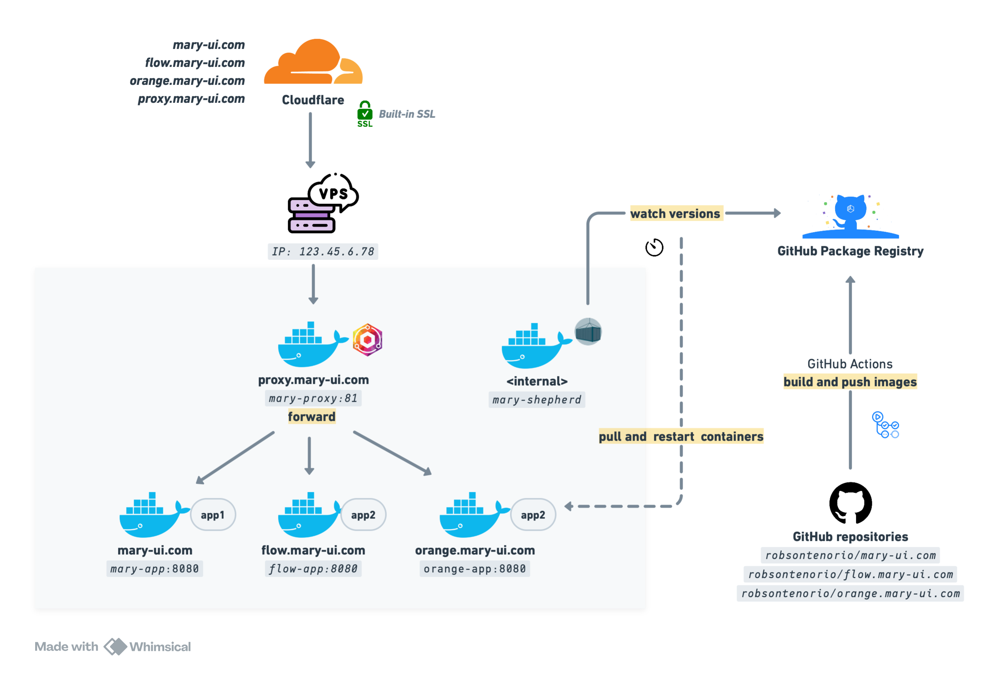
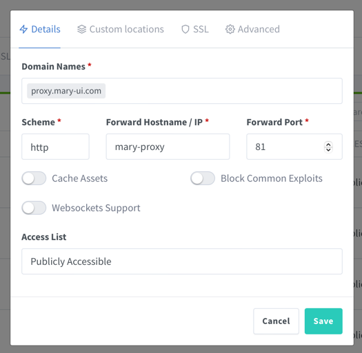

# Docker Swarm

A simple approach to deploy **multiple** Laravel projects using Docker Swarm on **same server**.



**Tools**

- **Nginx Proxy Manager** forwards all the incoming traffic to the correct container.
- **GitHub Actions** build the images and push to **GitHub Private Registry**.
- **Shepherd** will update the services when a new version is available on the Registry.
- **Docker Swarm** will handle zero downtime deployments and rollback.

## When to use it

- Projects does not have a lot of traffic.
- You want to put them all on same server to save money.

## Pre-requisites

- A project on GitHub.
- A brand-new VPS.
- A domain name registered on Cloudflare.
- Be comfortable with Docker.
- Be comfortable GitHub Actions.

## Important

> [!WARNING]
> This document describes the use case of `mary-ui.com` project and its demos. Of course, you must adapt it to your own projects.

## GitHub Actions

Set up a GitHub Action on **each repository** to build docker images and push them to the **Private GitHub Registry**.

```bash
# Github repository

robsontenorio/mary-ui.com         
|   
|__ .docker/
|    |
|    |__ Dockerfile                   
|
|__ .github/
|    |
|    |__ workflows/
|       |
|       |__ docker-publish.yml    # <-- You are here!
|               
|__ app/
|__ bootstrap/
|__ database/
|__ ...
``` 

See [docker-publish.yml](template/docker-publish.yml) GitHub Action.

**Images**

The above GitHub Action will produce these images:

- `ghcr.io/robsontenorio/mary-ui.com:production`
- `ghcr.io/robsontenorio/mary-ui.com:stage`

**Approach**

- A git tag like `x.y.z` always builds the `production` docker image tag.
- A git tag like `stage-xxxx` always builds the `stage` docker image tag.

**Why?**

- You need a fixed tag to use on the `docker-compose.yml` files.
- Otherwise, you will need to update the `docker-compose.yml` every time you push a new docker image tag.

## VPS Setup

**DOCKER**

```bash
# Install Docker
curl -fsSL https://get.docker.com -o get-docker.sh &&
sudo sh ./get-docker.sh &&

# Enable on startup
sudo systemctl enable docker.service &&
sudo systemctl enable containerd.service &&

# Init Swarm
docker swarm init
```

**GITHUB PRIVATE REGISTRY**

This is required to pull images from GitHub Private Registry using
a [GitHub Classic Token]((https://docs.github.com/en/authentication/keeping-your-account-and-data-secure/managing-your-personal-access-tokens#creating-a-personal-access-token-classic)).

```bash
export CR_PAT=<REGISTRY_TOKEN> &&
echo $CR_PAT| docker login ghcr.io -u <USERNAME> --password-stdin 
```

## Project setup

**NETWORK**

- All services will join to this network.

```bash
docker network create -d overlay mary
```

**VOLUMES**

- Create all needed volumes for each service.

```bash
# Apps
docker volume create mary-db &&
docker volume create paper-db &&
docker volume create orange-db &&
docker volume create flow-db &&
docker volume create ping-db && 

# Proxy
docker volume create mary-proxy-data &&
docker volume create mary-proxy-letsencrypt
```

**STRUCTURE**

- Create the following structure on **your VPS**.

```bash
YOUR_VPS
|   
|__ .env.mary
|__ .env.flow
|__ ...
|__ ...
|__ .env.shepherd
|__ docker-compose.yml
```

**ENV FILES**

- Create a `.env.xxxx` file for each service.

```bash
# .env.mary

APP_URL=https://mary-ui.com
APP_ENV=production
APP_DEBUG=false
APP_KEY=...
``` 

```bash
# .env.flow
# .env.orange

# keep going for each service ...
```

- Also create `.env.shepherd` for the `shepherd` service.
- It auto deploy the services when a new version is available on Registry.
- Use the same credentials you used to log in on the GitHub Private Registry on "VPS Setup" step above.

```bash 
# .env.shepherd

REGISTRY_HOST=ghcr.io
REGISTRY_USER=<USERNAME>
REGISTRY_PASSWORD=<TOKEN>
WITH_REGISTRY_AUTH=true
SLEEP_TIME=30s
FILTER_SERVICES=label=shepherd.autodeploy=true
```

**COMPOSE FILE**

> [!WARNING]
> - At this point make sure you have pushed the images to the GitHub Registry.
> - Do not map ports for your apps. The Nginx Proxy Manager will handle it.
> - You could split it into multiple compose files.

See [docker-compose.yml](template/docker-compose.yml).

## Deploy the stack

- This term `stack` refers to a group of services that are defined in a `docker-compose.yml`.
- If you change any configuration on `docker-compose.yml` you need to re-deploy the stack.
- Think it as a `docker-compose up` command, but for Swarm.
- After deploy see  **Nginx Proxy Manager** at http://YOUR-VPS-IP-ADDRESS:81

```bash 
#               [see the progress]  [compose file]    [name it]    [private registry]
#                         |                |              |              |         
                                
docker stack deploy --detach=false -c docker-compose.yml mary --with-registry-auth
```

## Point your domains to the VPS

- The root registered domain is `mary-ui.com`
- Create more domains or subdomains for each service.
- Make sure to create an extra `proxy` subdomain.
- Point all of them to the same IP address of **your VPS**.
- Cloudflare provides the SSL certificate for all domains/subdomains for free.
- You do not need to do anything else on your VPS.


## Configure the proxy hosts

**CHECKLIST**

- Make sure you already have pointed the domains to the VPS.
- There is no need to configure the SSL certificate on proxy hosts, Cloudflare will do it for you.
- Use the "service name" and  "port" to configure the proxy hosts.
- The internal services communication is through `http` not `https`.

**LOGIN ON PROXY MANAGER PANEL**

- http://YOUR-VPS-IP-ADDRESS:81
- User: admin@example.com
- Password changeme

**CREATE THE PROXY HOSTS**

- Go to `Hosts > Proxy Hosts`

**ADD "PROXY.MARY-UI.COM"**

- The domain for this panel itself.
- Notice the port `81` is exposed by `jc21/nginx-proxy-manager` docker image.



**ADD "MARY-UI.COM"**

- The domain for `https://mary-ui.com`
- Notice the port `8080` is exposed by `robsontenorio/laravel` docker image from our project.
- If your project uses websockets, just enable ""Websockets Support" toggle.


- Add this entry on "Custom locations" tab, to make Livewire file upload work.


**ADD OTHERS**

Keep going to all domains you have pointed.

## Test it

At this point all domains should be working.

## Zero downtime deployments and rollback

These configs below make zero downtime deployments and rollback possible,
whenever you need to re-deploy the stack or update the service images.

Depending on how long your health check takes to pass, you may need to adjust the `start_period` and `timeout` values.

```yaml
# This is configured for each service on `docker-compose.yml`

healthcheck:
# ...
deploy:
    update_config:
    # ...
    rollback_config:
    # ...
```

## Deploying new image versions

- Push a new code to the repository.
- Create a new **git tag**.
- The **GitHub Action** will build the image and push it to the **GitHub Private Registry**.
- The `shepherd` service will update the service when a new version is available on the registry.
- Profit!
